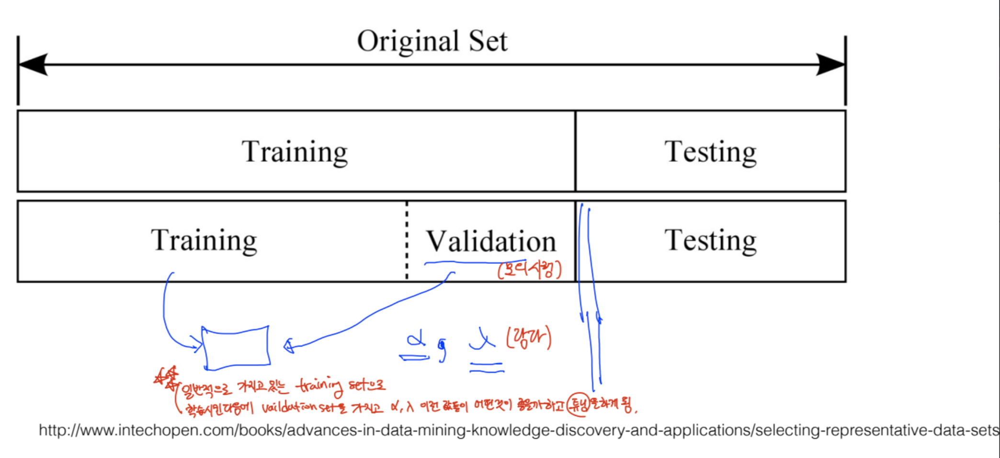
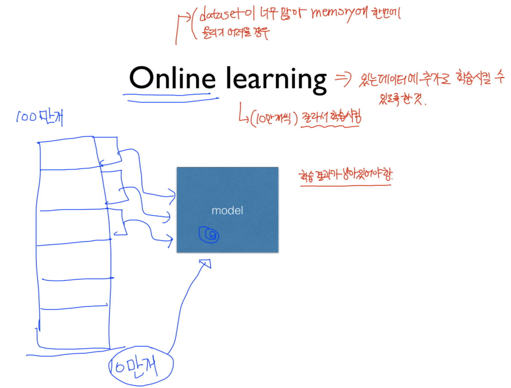

# Dataset 
> 학습 또는 테스트를 진행하기 위한 데이터들의 집합

ML/DL에서 사용되는 Dataset은 크게 Testing dataset과 Testing dataset으로 구분할 수 있다. 

일반적으로, Dataset을 받을 경우 70% 는 Training dataset으로 지정하고 30% 정도는 Testing dataset으로 지정한다. 

하지만, 실제로 적절한 learning rate을 지정해주거나 overfitting을 막기 위해 lamda 값을 조정하는 작업을 수행할 필요가 있기에 위와 같이 Validation을 진행하기도 한다. 

Validation은 Training dataset의 일부를 가져와 learning late이나 lamda 값을 조정하기 위해 사용되는 데이터 셋이라고 볼 수 있다. 

## Online learning
> 데이터를 모두 저장할 수 있는 공간이 없기 때문에 데이터를 잘라 여러 번 학습 시키는 것

예를 들어, Dataset에 존재하는 데이터의 개수가 100만 개라고 가정해보자. 
이러한 경우에는 데이터를 모두 저장할 수 있는 공간이 없기 때문에 데이터를 잘라 여러 번 학습 시켜주는 작업을 하게 됩니다. 이를 <strong>Online learning</strong> 이라고 합니다. (단, 학습 결과가 계속해서 남아있어야 함)