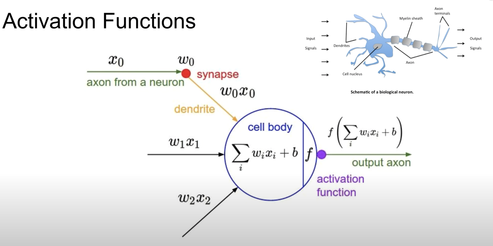
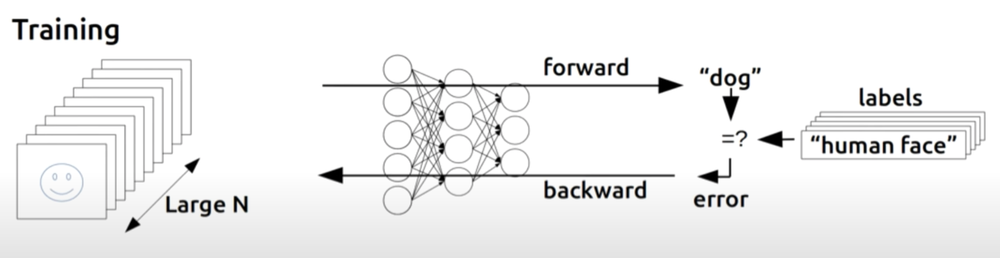
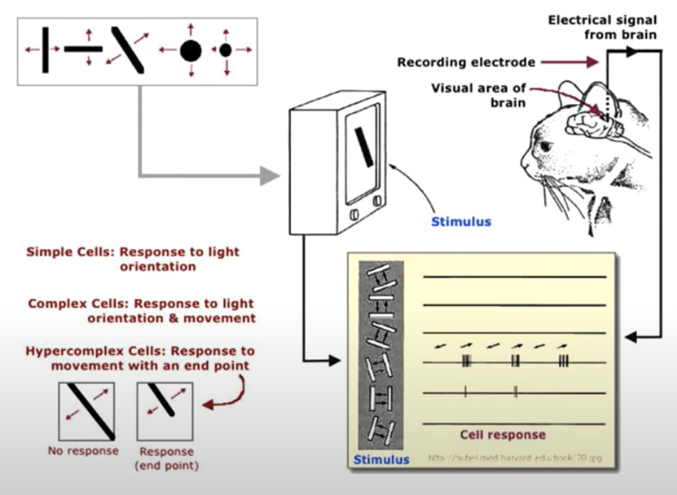
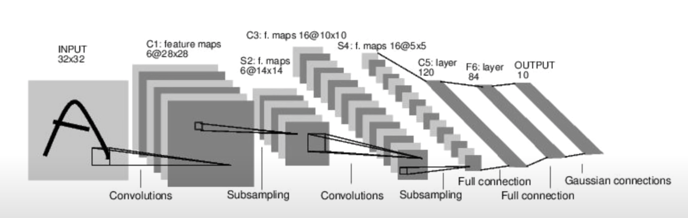
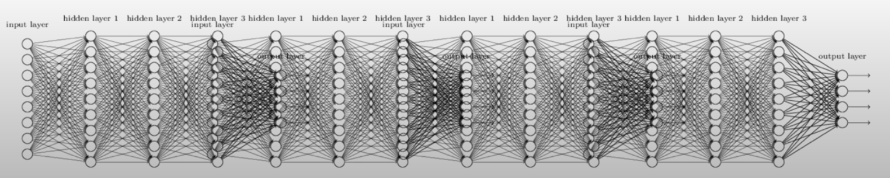

# Deep Learning
> 기계가 스스로 학습하여 복잡한 문제를 해결할 수 있도록 하는 것

## Activation Functions
> cell body에서 합한 값이 어떤 일정 값을 넘어가면 그 다음으로 값을 보내주고, 즉 1이라는 신호를 주고, 이 값이 어떤 값보다 작으면 0이라는 신호를 주어 동작하는 것

## Backpropagation 
> 1974, 1982년 Paul Werbos에 의해 만들어진 방식으로 <strong>예측한 결과에 대한 에러 값을 구해 뒤로 전달해 나아가면서 각각의 W, b 값들을 조정하는 방법</strong>

Networks이 연결되어 있으며 각각이 W, b 값을 가지게 되고, 이 값으로 주어진 입력에 대한 출력을 만들 수 있게 되는데 만일 예측이 틀릴 경우 W, b 값을 조정해줘야 한다. 

이때, backpropgation 방식을 활용하여 더 복잡한 예측이 가능해지게 되었던 것이다. 

## Neural Networks 

초기 Hubel & Wiesel이 고양이를 통해 실험을 하였는데 그림의 형태에 따라 전체가 아닌 일부의 Neuron들만 활성화되는 것을 확인하였다. 이를 통해, 어떤 신경망 세포가 동시에 그림 전체를 보는 것이 아닌 일부의 부분 부분들을 담당하는 신경망들이 존재하고 그것이 나중에 조합되는 것이 아닐까? 라는 것을 관찰하게 된 것이다. 

위 아이디어를 기반으로, 일부를 잘라서 다음 Layer에 보내고, 나중에 이러한 조각조각들을 합치는 방식으로 아래와 같은 모델을 개발하였다.  
   

## Big problem

그 당시, Pual Werbos가 주장한 Neural Networks에 큰 문제가 존재했었다. 
Backpropagation이 2~3개 정도의 Layer에서는 잘 동작하였지만, 복잡한 문제를 풀기 위해서는 여러 개의 Layer들을 필요로 하였다. <strong>하지만, 여러 개의 Layer를 사용할 경우 뒤로 보낼 때 그 의미가 갈수록 약해져서 뒤쯤가서 에러가 거의 전달되지 않고 학습을 시킬 수 없게 된 것이었다. </strong>

## Solution about big problem

2006, 2007년 Hinton & Bengio에 의해 Big problem 문제의 해결책을 찾게 되었다. 
<strong>"만일 초기 weight 값을 잘 지정해주면, 많은 Layer들을 가진 Neural networks도 잘 학습할 수 있다"</strong> 라는 사실이 증명되었고 Neural networks라는 이름에서 Deep Learning 이라는 이름으로 Rebranding하여 지금까지 역사가 이어져 오고 있게 된 것이다. 

