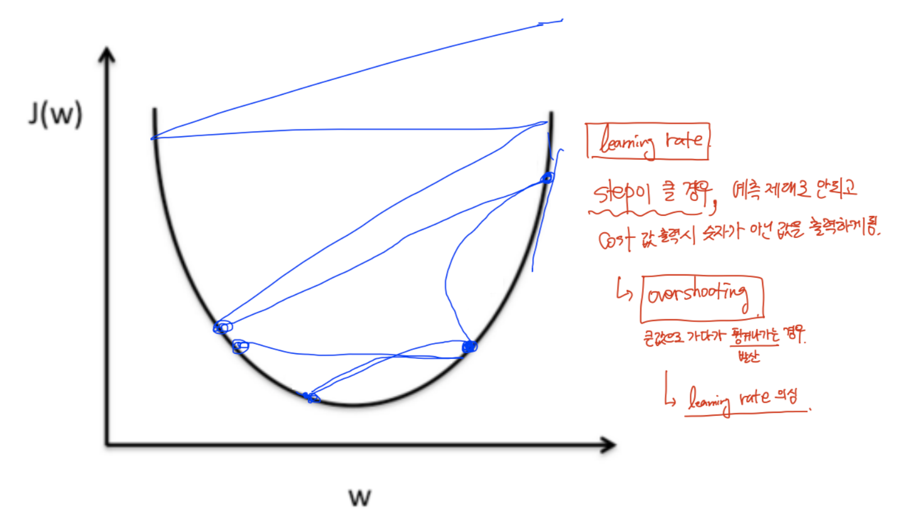
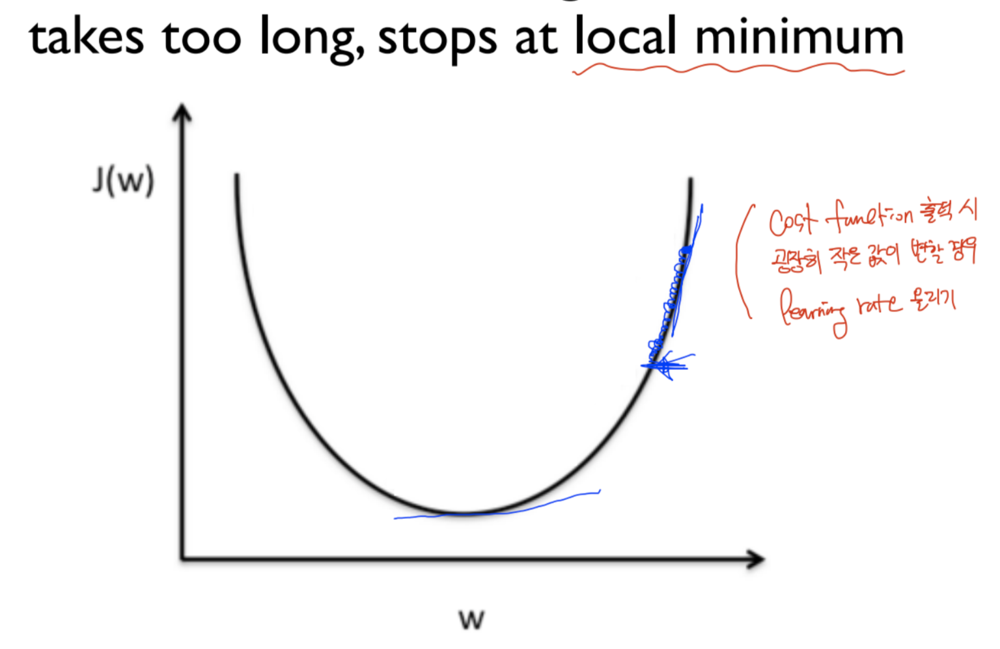

# Learning rate 
> Cost function에 특정 점에서 기울기 값을 얼마나 조정할 것 인지를 결정하는 요소

## Large learning rate: Overshooting

Learning rate가 너무 클 경우, 이동하는 폭이 너무 커서 극솟값을 찾지 못할 수도 있다. 

<strong>현상</strong>
즉, 예측을 제대로 할 수 없게 되며 큰 값으로 가다가 튕겨나가게 되어 Cost 값 출력 시 숫자가 아닌 값을 출력하게 된다. 

## Small learning rate 
Learning rate를 너무 작게 할 경우, 이동하는 폭이 너무 짧아 극솟값 지점에 도달하지 못할 수 있다. 

<strong>현상</strong>
Training 시, Cost 값이 거의 변경되지 않고 특정 값에 계속해서 머무르는 것을 볼 수 있다. 

## how to set learning rate
- Observe the cost function 
- Check it goes down in a reasonable rate
    기본 값으로는 <strong>0.01</strong>을 사용한다. 
    - 발산 -> Learning rate을 좀 더 작게 
    - 거의 변화 없음 -> Learning rate을 좀 더 크게 
