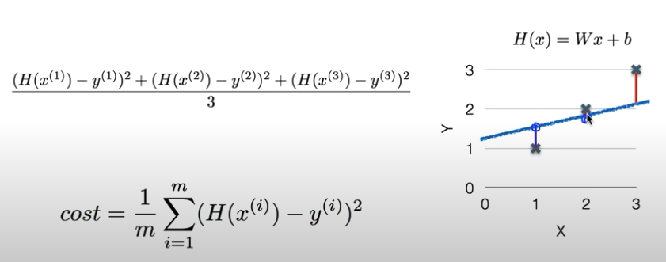
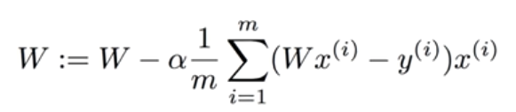

# Regression 
> 학습된 데이터를 기반으로 특정 입력 값에 대한 예측을 해주는 것

Regression model을 학습한다는 것은 하나의 가설을 세울 필요가 있다. 

## 1. Linear regression
    
### 1.1 (Linear) Hypothesis
        
    Ex) H(x) = Wx + b

- Which hypothesis is better?
        
    거리를 통해 비교하여 좋은 것을 찾는다. (거리가 가까울 수록 좋은 것)

###  1.2 Cost(= Loss) function 
> 우리가 세운 가설과 실제 데이터가 얼마나 다른가를 나타내는 것

<strong>주로 차이의 제곱을 해준다.</strong> 

m: 데이터 갯수, y: true
W와 b를 조정하여 가장 작은 값을 가지도록 하는 것이 학습이다. 

### 1.3 minimize cost(W,b) 
> W, b가 최소가 되는 값을 찾는 과정을 학습이라한다. 

### Gradient descent algorithm
- Minimize cost function 
- Gradient descent is used many minimization problems 
- For a given cost function, cost(W,b), it will find W,b to minimize cost
- It can be applied to more general function: cost (w1, w2, ...)

### 원리
1. Start with initial guesses 
   1.1. Start at 0,0 (or any other value)
   1.2. Keeping changing W and b a little bit to try and reduce cost(W,b) 

2. Each time you change the parameters, you select gradient which reduces cost(W,b) the most possible
   
3. Repeat 
   3.1 Do so until you converge to local minimum 
   3.2 Has an interesting property 
   (Where you start can determine which minimum you end up)

### Convex function 
> 밥그릇 형태를 띄는 것을 의미

어느 점에서 시작하던간에 Gradient descent algorithm을 적용하면 작은 값을 찾을 수 있음을 보장해주기 때문에 Convex function 형태를 띄는지 확인할 필요가 있다. 

### Multi-variables 
하나의 element를 가지는게 아닌 여러 개의 element, 즉 instance를 가지는 경우 H(x1,x2,x3,...,xn) = w1x1 + w2x2 + w3x3 + ... + wnxn + b 이와 같이 식이 너무 길어져서 구현하는데 있어 불편함이 존재한다. 

이러한 경우, Matrix를 사용하면 보기 쉽게 표현할 수 있게 되며 행렬에 곱의 법칙을 활용하여 계산될 수 있다. 

주로 결과가 주어져 아래와 같은 형태를 띄게 되고, [?, ?] 부분은 [variable 갯수, column of H(x) matrix]로 결정된다. 

<strong>[instance 갯수, variable 갯수] X [?, ?] = [5, 1] (H(x) matrix)</strong>

즉, Multi-variables을 다루기 위해서는 Matrix를 활용하여 Hypothsis [H(x) = Wx + b]를 H(X) = XW로 나타내어 구현할 수 있다. 

## Summary
- Hypothesis
- Cost function 
- Gradient descent algorithm 

<strong>즉, Hypothsis와 cost function을 정의한 후, 미분하는 과정을 거쳐 아래와 같은 수식을 형성한 후, gradient descent algorithm을 사용하여 최소 값을 가지는 W와 b를 찾는 과정(학습)을 통해 Linear Regression을 적용할 수 있다. (단, 적용하기 전 Convex function 형태를 띄는지 확인할 필요가 있다.)</strong>

