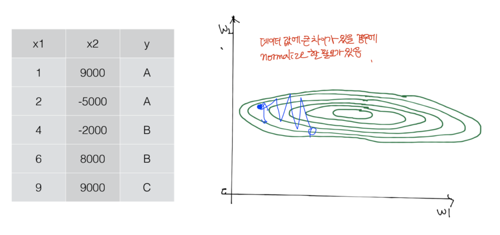

# Normalization
> 데이터 값들이 어떤 형태의 범위 안에 항상 들어가도록 해주는 방법



## 정규화를 해야하는 이유
머신러닝 알고리즘은 데이터의 feature(특성)들을 비교하여 패턴을 찾는다.
예를 들어, Gradient descent algorithm을 적용할 때 feature의 스케일이 큰 차이가 날 경우 가장 작은 weight을 찾지 못하고 밖으로 튕겨나가게 될 수 있다. 그러므로, 이러한 경우 training이 올바르게 되지 않을 수 있기 때문에 normalize를 할 필요가 있다. 

## 확인 사항
즉, learning rate를 제대로 지정했지만, 학습이 잘 안되면 데이터 중 차이가 큰 값이 존재할 수도 있기에 Data Preprocessing을 진행해준다. 

## 정규화 방법
1. Min-Max Normalization (최소-최대 정규화)
2. Z-Score Normalization (Z-점수 정규화) 

## Min-Max Normalization 
> 모든 feature에 대해 각각의 최소값 0, 최대값 1로, 나머지 값들은 0과 1 사이의 값으로 변환하는 방법 

### Expression
<strong>( X - MIN ) / (MAX - MIN)</strong>

### 단점
<strong>이상치에 큰 영향을 받는다.</strong>
예를 들어, 가장 큰 값이 1000이고 나머지 값들이 0 ~ 100 사이의 값을 가질 경우 1000이라는 값이 1을 가지고 나머지 값들은 0 ~ 0.1 사이의 값을 가지게 되어 이상치에 큰 영향을 받게 된다. 

## Z-Score Normalization
> 이상치(outlier)문제를 해결하기 위한 방법으로써 표준화를 진행하여 정규화 수행

### Expression
<strong>Z = (X - 평균) / 표준편차</strong>

### Python
```python 
x_std[:,0] = (X[:,0] - X[:,0].mean()) / X[:,0].std()
```
