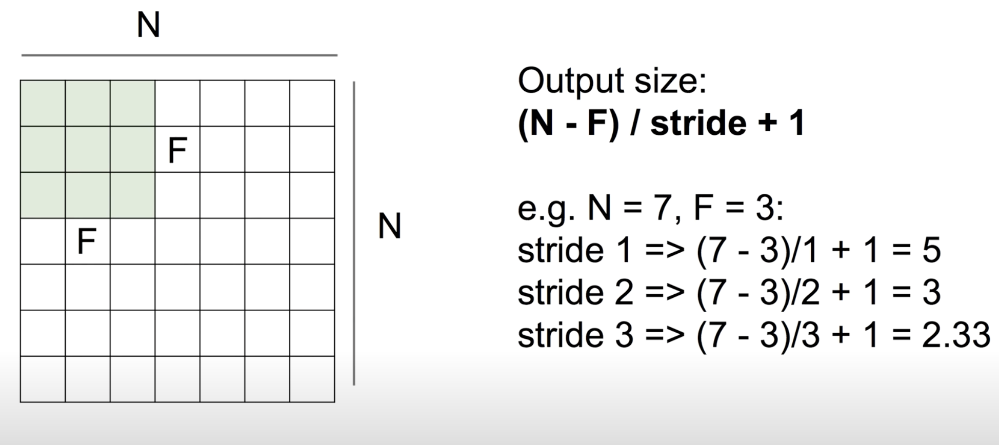

# Convolutional Neural Networks (CNN)

### Filter
한 번에 얼마만큼 필터링할지 지정하여 한 개의 값으로 만들어냄 (ex, 5x5x3)

똑같은 filter를 사용하여 전체 이미지에 각각의 한 점에 대한 값을 가져옴

1. Weight 개수 정하기 
2. 어떻게 넘길지 설계 

### Stride
몇 칸씩 움직일 것 인지

