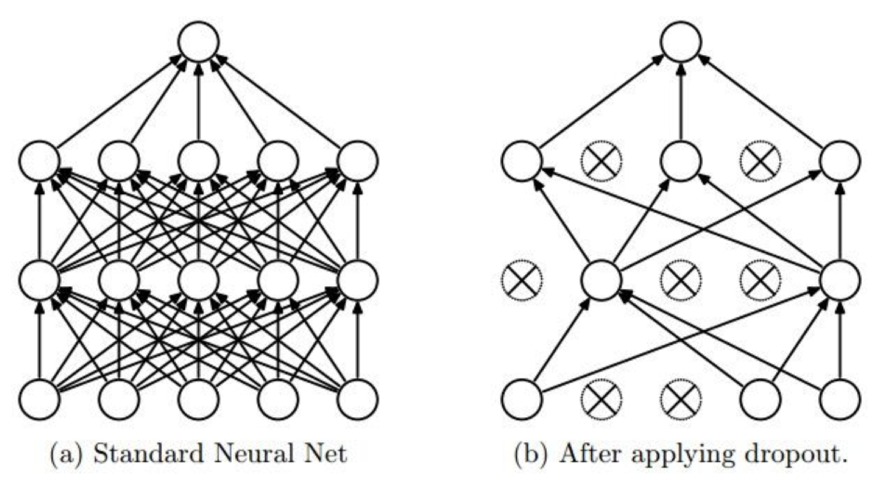

# Dropout


> Randomly set some neurons to zero in the forward pass

<strong>랜덤하게 쉬어가며 동작, 마지막에 총동원해서 예측</strong>

### Dropout rate
<strong>Training</strong>
Default dropout rate: 0.5

<strong>Test</strong>
Default dropout rate: 1

## Tensorflow implementation 
```python 
dropout_rate = tf.placeholder("float")
_L1 = tf.nn.relu(tf.add(tf.matmul(X, W1), B1))
# dropout
L1 = tf.nn.dropout(_L1, dropout_rate) 
```