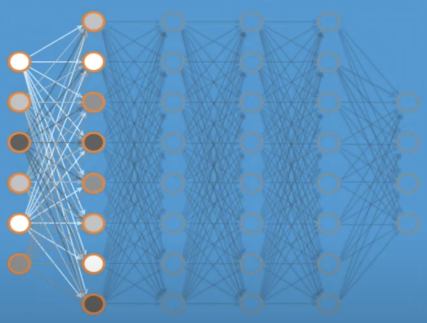
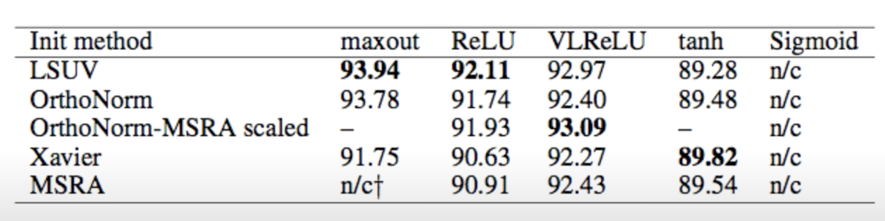

# Weight

### 문제점
깊은 네트워크를 학습하려고 할 때 Weight의 초기 값을 잘 지정해주는 것이 중요

그에 따른 해결책으로, Weight 지정을 위해 Restricted Boltzmann Machine 이라는 기법이 등장

이후, 복잡한 Restricted Boltzmann Machine을 굳이 사용하지 않고도 좋은 성능을 낼 수 있다는 사실을 알게됨. 

## Restricted Boltzmann Machine (RBM)


> 두 Layer 간에 Forward, Backword 과정을 거쳐 입력을 재생산하여 그 전 값과 새로 생산된 입력 값의 차이가 최소가 되도록 weight을 조절하는 방식

- Forward - weight와 bias 값을 곱하여 출력 값 지정하여 activation 여부 결정
- Backword - weight 값은 그대로 두고 Forward 과정에서 생성된 출력 값을 다시 거꾸로 weight와 bias 값을 곱하여 새로운 입력 값 생성 

### How to use RBM to initialize weights?
- Apply the RBM data on adjacent two layers as a pre-training step 
- Continue the first process to all layers 
- This will set weights 
  
## Simple methods
- ### Xavier initialization (2010)
  - Makes sure the weights are 'just right', not too small, not too big
  - Using number of input (fan_in) and output (fan_out) 
      
  ###

  ```Python 
  # Xavier initialization
  # Glorot et al. 2010 
  W = np.random.randn(fan_in, fan_out)/np.sqrt(fan_in) 
  ```
  - #### Prettytensor implementation 
  ```python 
    def xavier_init(n_inputs, n_outputs, uniform=True): 
        """Set the parameter initialization using the method described. 
        This method is designed to keep the scale of the gradients roughly the same in all layers. 
        Xavier Glorot and Yoshua Bengio (2010): 
            Understanding the difficulty of training deep feedforward neural networks. International conference on artificial intelligence and statistics. 
        Args: 
            n_inputs: The number of input nodes into each output
            n_outputs: The number of output nodes for each input
            uniform: If true use a uniform distribution, otherwise use a normal. 
        Returns: 
            An initializer
        """
        if uniform:
            # 6 was used in the paper. 
            init_range = math.sqrt(6.0 / (n_inputs + n_outputs))
            return tf.random_uniform_initializer(-init_range, init_range)
        else:
            # 3 gives us approximately the same limits as above since this repicks
            # values greater than 2 standard deviations from the mean
            stddev = math.sqrt(3.0 / (n_inputs + n_outputs))
            return tf.truncated_normal_initializer(stddev=stddev)
    
  ```
- ### He's initialization (2015)

  ```Python 
   # He et al. 2015
  W = np.random.randn(fan_in, fan_out)/np.sqrt(fan_in/2) 
  ```

### Activation functions and initialization on CIFAR-10 


[Minhkin et al. 2015]
