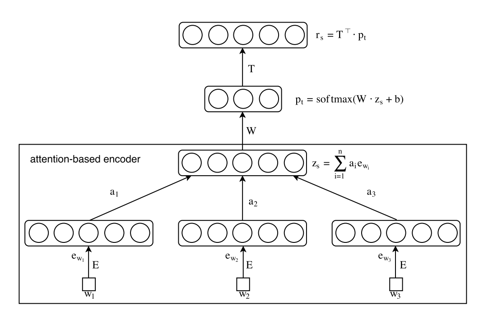
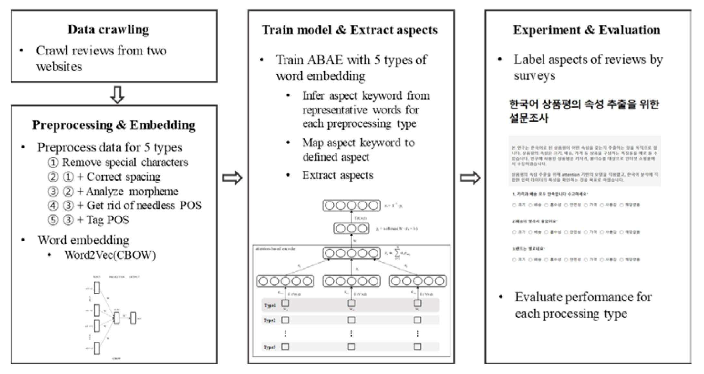

## Reference
박명현, 최회련 and 이홍철. (2021). 비지도 학습 기반의 한국어 속성 추출에 적합한 전처리 방법 연구: 육아용품 상품평을 대상으로. 대한산업공학회지, 47(1), 56-67.

## 속성 추출 방식

- 규칙 기반 방식 (rule-based)
- 지도 학습 방식 (supervised learning)
- 비지도 학습 방식 (unsupervised learning)

Attention은 속성과 관계없는 단어들의 가중치는 낮게 학습하는 구조로 속성 추출의 성능을 높였다. 

## 연구에서 사용된 내용

- ### Word2Vec - CBOW (Continuous Bag-of-Words)
  인공 신경만 구조를 이용, 데이터를 효율적으로 계산
  - CBOW 모델 - 문장이나 문서에서 윈도우 크기만큼의 주변 단어가 주어질 때 중심 단어를 잘 예측하는 단어 표상을 찾도록 학습
  - Skip-gram 모델 - 중심 단어가 주어질 때 주변 단어를 예측하는 방법
  
- ### 속성 추출 성능 비교 - GloVe & FastText
  
  - GloVe - 제안한 분산 표상 방식의 하나
    말뭉치 전체를 대상으로 두 단어 간 동시 발생 수를 학습에 이용

  - FastText - 단어를 글자의 n-gram으로 표현하는 Skip-gram 기반의 분산 표상 방식
    단어 벡터는 n-gram 벡터의 합으로 표현되면 학습 방식은 Word2Vec과 유사하다. 

- ### ABAE (Attention-based Aspect Extraction)
  Attention 기반의 비지도 속성 추출 모델을 사용하였다. Attenetion 모델은 입력한 정보 중에서도 해결하는 문제와 가장 적합한 정보에 집중하는 특성이 있다. ABAE는 임베딩 공간에서 각 속성을 나타내는 대표 단어를 통해 해석이 가능한 속성 임베딩을 학습하는 것을 목표로 한다. 

  #### ABAE Structure
   

  Attention 가중치는 각 단어가 문장의 핵심 주제를 알아내는데 얼마나 주목할 만한지를 확률로 나타낸다.

  

  - #### :star: 재구성(reconstruction) 오류를 최소화 방안
    부정표본 (nagative sample) $n_i$를 무작위로 추출하고, 재구성된 $r_s$가 $z_s$와는 유사하되 $n_i$와는 다르도록 식 (7)을 목적함수로 지정한 후 학습

  - #### :star: 속성 임베딩 행렬의 중복 문제 해결 방안
    정규화 과정을 거쳐 식 (9)의 비용 함수가 정의되며, 학습을 통해 각 문장의 속성에 해당되는 대표 단어를 얻게 됨.

## 구조

