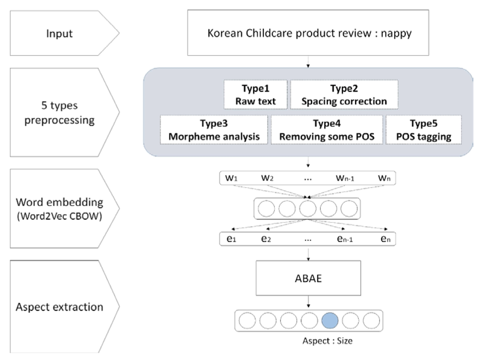
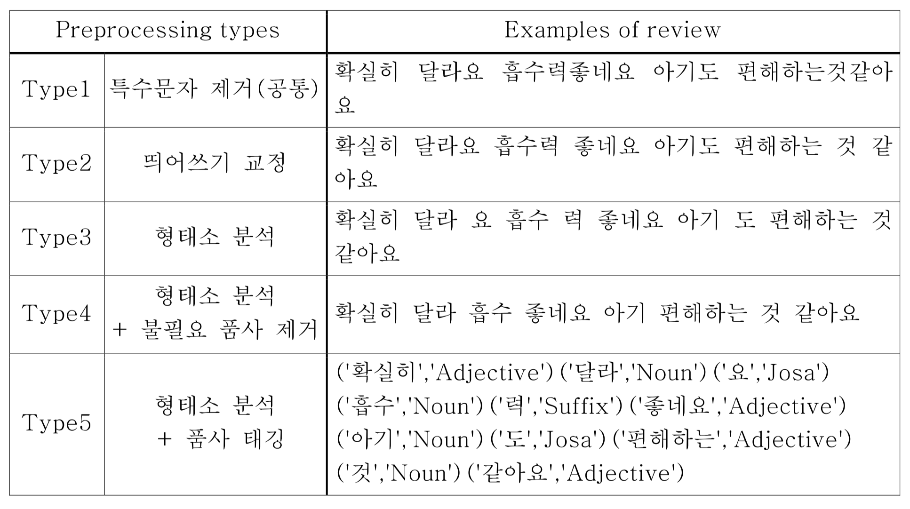
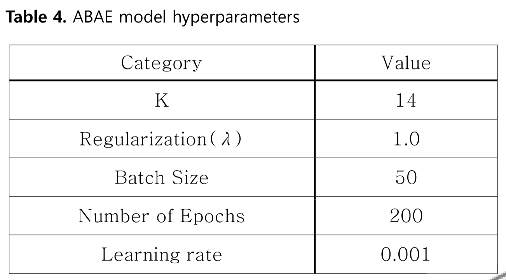
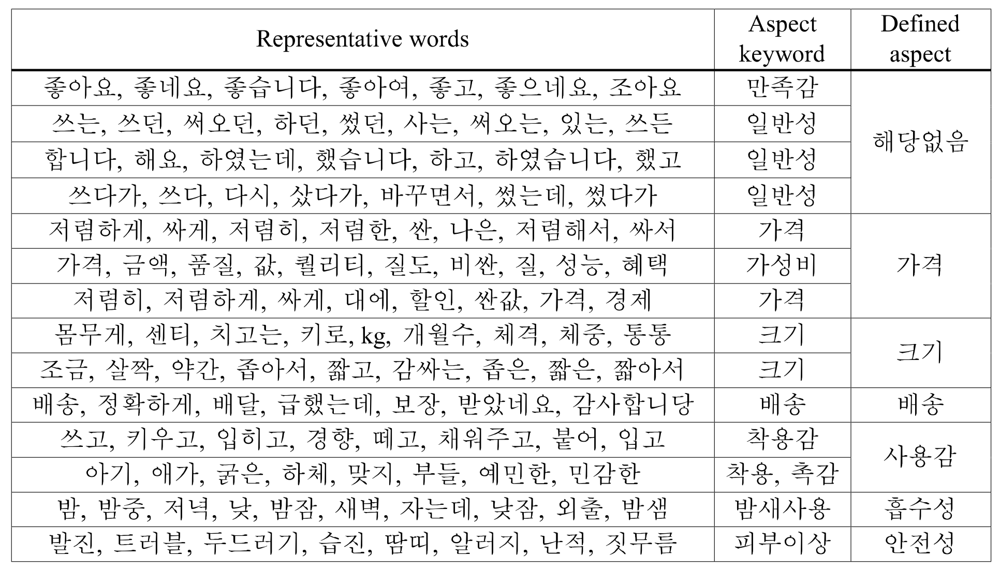
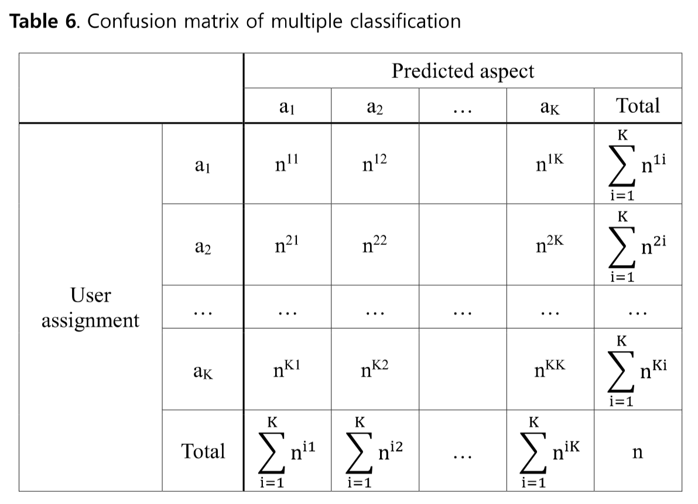
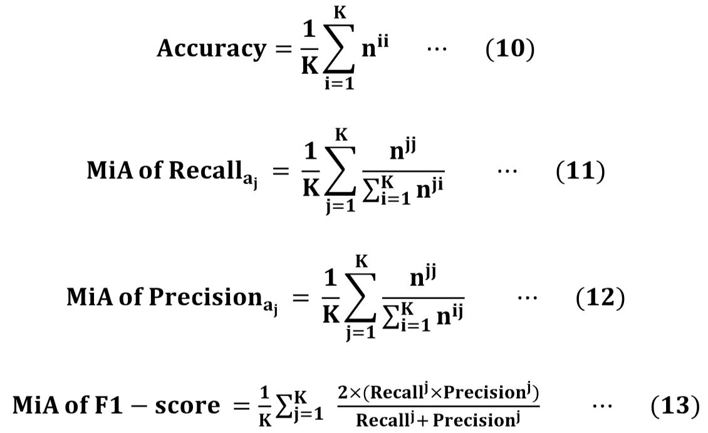
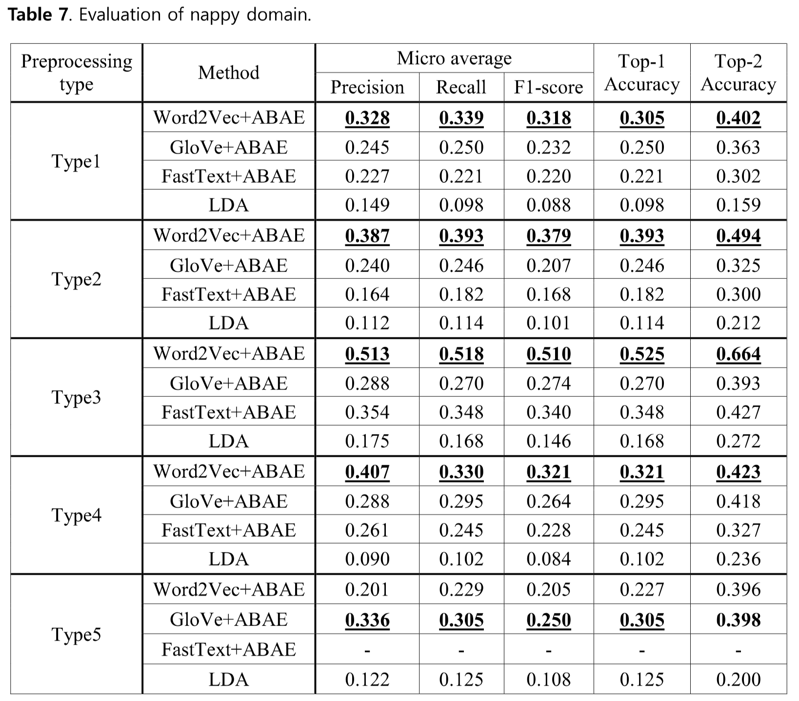

## 논문 
박명현, 최회련 and 이홍철. (2021). 비지도 학습 기반의 한국어 속성 추출에 적합한 전처리 방법 연구: 육아용품 상품평을 대상으로. 대한산업공학회지, 47(1), 56-67.

## 속성 추출 방식

- 규칙 기반 방식 (rule-based)
- 지도 학습 방식 (supervised learning)
- 비지도 학습 방식 (unsupervised learning)

Attention은 속성과 관계없는 단어들의 가중치는 낮게 학습하는 구조로 속성 추출의 성능을 높였다. 

## 연구에서 적용된 모델

- ### Word2Vec - CBOW (Continuous Bag-of-Words)
  인공 신경만 구조를 이용, 데이터를 효율적으로 계산
  - CBOW 모델 - 문장이나 문서에서 윈도우 크기만큼의 주변 단어가 주어질 때 중심 단어를 잘 예측하는 단어 표상을 찾도록 학습
  - Skip-gram 모델 - 중심 단어가 주어질 때 주변 단어를 예측하는 방법
  
- ### 속성 추출 성능 비교 - GloVe & FastText
  
  - GloVe - 제안한 분산 표상 방식의 하나
    말뭉치 전체를 대상으로 두 단어 간 동시 발생 수를 학습에 이용

  - FastText - 단어를 글자의 n-gram으로 표현하는 Skip-gram 기반의 분산 표상 방식
    단어 벡터는 n-gram 벡터의 합으로 표현되면 학습 방식은 Word2Vec과 유사하다. 

- ### ABAE (Attention-based Aspect Extraction)
  Attention 기반의 비지도 속성 추출 모델을 사용하였다. Attenetion 모델은 입력한 정보 중에서도 해결하는 문제와 가장 적합한 정보에 집중하는 특성이 있다. ABAE는 임베딩 공간에서 각 속성을 나타내는 대표 단어를 통해 해석이 가능한 속성 임베딩을 학습하는 것을 목표로 한다. 

  #### ABAE Structure
   

  Attention 가중치는 각 단어가 문장의 핵심 주제를 알아내는데 얼마나 주목할 만한지를 확률로 나타낸다.

  

  - #### :star: 재구성(reconstruction) 오류를 최소화 방안
    부정표본 (nagative sample) $n_i$를 무작위로 추출하고, 재구성된 $r_s$가 $z_s$와는 유사하되 $n_i$와는 다르도록 식 (7)을 목적함수로 지정한 후 학습

  - #### :star: 속성 임베딩 행렬의 중복 문제 해결 방안
    정규화 과정을 거쳐 식 (9)의 비용 함수가 정의되며, 학습을 통해 각 문장의 속성에 해당되는 대표 단어를 얻게 됨.

## 실험 구조

## Flow

### :star: 전처리 방식 (총 5 가지 형태로 실험)
Type1과 Type2는 Type 3,4,5에 모두 공통으로 적용

Type 1. 특수문자 제거 
Type 2. 띄어쓰기 교정 (CountSpace, ChatSpace 비교 후, ChatSpace 사용)
Type 3. 형태소 분석
Type 4. 형태소 분석 + 불필요 품사 제거 (형태소 분석 후 의미상의 속성이나 속성에 대한 감정을 나타낼 수 있는 명사/형용사/동사/부사/영어/숫자 외의 품사를 제거)
Type 5. 형태소 분석 + 품사 태깅 (형태소 분석과 품사 선택 및 품사 태그 부착에는 한국어 자연어 처리를 위한 konlpy의 Okt 형태소 분석기 사용)

### 단어 벡터

#### Word2Vec (CBOW model) & GloVe & FastText
벡터 크기 = 200, 윈도우 크기 = 4, 최소 빈도수 = 10, 네거티브 샘플링 크기 = 5

신경망 반복 횟수 = 100

<strong>Type 5의 경우, FastText 특성상 품사 태깅한 데이터의 임베딩 결과가 ABAE 적용에 부적절하여 제외</strong>

## 모델 학습 및 결과 도출 과정

1. 입력 단계 
  Type 1~5개 방식으로 전처리된 데이터가 한 문장 단위로 입력
2. 임베딩 단계
  문장은 각각 Word2Vec, GloVe, FastText 모델에 의해 학습된 임베딩 행렬을 거쳐 단어 벡터로 변환되어 Attention 층으로 입력
3. 군집화 단계
  문장을 각 속성별 확률로 나타내주는 속성 임베딩 행렬 T는 단어 임베딩 공간에서 k-means clustering을 시행하여 중심 값으로 초기화
4. 학습 단계
  ABAE model로 학습
5. 대표 단어 추출
  학습 이후, 임베딩 공간상에서 코사인 유사도를 이용하여 각 상품평에 해당되는 속성과 가장 가까운 대표 단어를 추출

본 연구에서 도메인별로 전처리 형태에 따른 5개의 학습 결과를 도출한 후, 14개의 속성마다 추출된 30개의 대표 단어를 기준으로 각 속성을 나타내는 키워드를 선정

### ABAE model 
- 속성의 개수 K: 14 (K가 14일 때 ABAE 모델의 loss값이 가장 작았음)
- 최적화 방식: Adam
- learning rate: 0.001
- epoch: 200 (15로 설정한 결과 loss 값이 수렴하지 못하였음)
  

### 예시

- Aspect keyword: 예측된 결과
- Defined aspect: 기저귀 제품에 대한 성능 비교 결과를 참고하여 7개 레이블 지정 

## 평가 지표
본 실험은 비지도 학습 기반으로 수행되어 각 상품평의 정답 레이블이 존재하지 않으므로 설문 조사를 통해 각 전처리 형태별 속성 추출 결과의 성능을 평가

분류 성능 평가를 위해 <strong>혼동 행렬 (confusion matrix)</strong>를 사용함. 혼동 행렬의 행은 분류한 속성을, 열은 속성 추출 모델이 분류한 속성을 의미한다.

## 실험 결과

기저귀 도메인의 경우, Type 5의 경우를 제외하고 Word2Vec + ABAE 방식이 좋은 성능을 보임. 

:star: <strong>ABAE 모델이 LDA 모델보다 성능이 좋게 나온 이유</strong>
ABAE 모델이 LDA보다 좋은 성능을 보인 것은 Attention 구조가 속성과 연관된 단어에 더 집중하고 비속성 단어는 강조하지 않는 특성이 학습에 반영된 것으로 판단

## 성능 평가

- Word2Vec + ABAE 모델이 가장 높은 성능을 보임

- Attention 구조는 속성과 연관된 단어에 초점을 맞춰 학습하는 것에 이점을 가짐

- Type 4 방식이 속성 추출에 가장 적합한 전처리 ('띄어쓰기 교정'이 형태소 분석의 성능에 영향을 줌, 형태소 단위로 임베딩하는 것, 불필요한 품사 제거)

- GloVe + ABAE 방식이 높게 나온 경우, GloVe는 전체 말뭉치에서 단어가 품사가 조합된 단위로 동시 발생 확률을 학습하는 방식으로 속성과 관련된 단어 학습에 도움을 준 것으로 판단

- FastText와 GloVe는 다양한 자연어처리 과제에서 좋은 성능을 보이지만, ABAE 모델에는 Word2Vec 임베딩이 가장 효과적

## 결론
속성 추출에는 Word2Vec + ABAE 모델이 효과적이다. 하지만, 다중 속성을 가진 상품평의 경우에 하나의 정답 속성과 차이가 발생하여 오차가 커지는 결과를 확인하였다. 세부 속성별로 상품평을 작성하도록 양식을 제시할 경우에 적합하게 사용될 수 있다. 