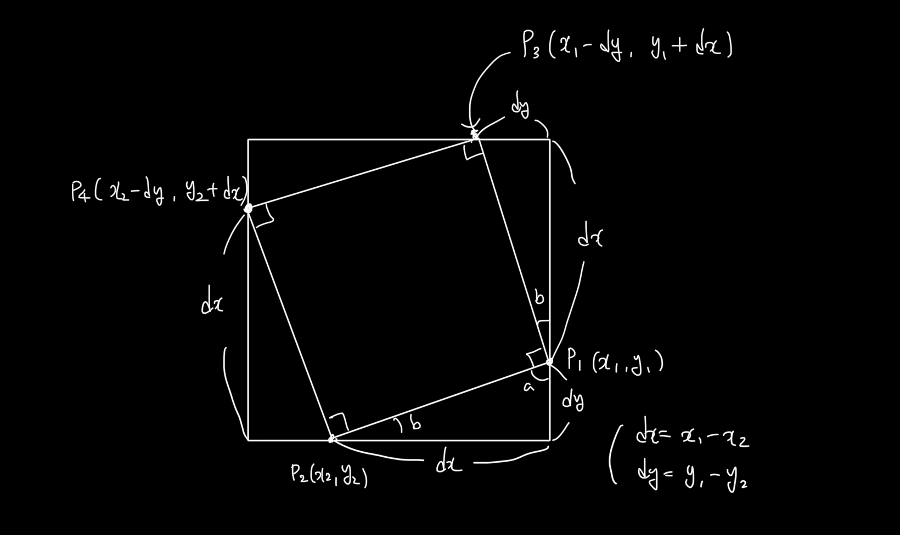

# 두 점으로 정사각형 찾기

정사각형 성질을 이용하면 2개의 점을 이용하여 다른 두 점을 찾을 수 있다. 

$dx = x_1 - x_2$
$dy = y_1 - y_2$

$p_1,\,p_2$ 점을 알 때, 나머지 점 $p_3,\,p_4$를 이와 같이 구할 수 있다. 
(내부 삼각형이 모두 합동이라는 점을 활용)

:star: $p_1(x_1,\,y_1),\,p_2(x_2,\,y_2),\,p_3(x_1 - dy,\,y_1 + dx),\,p_4(x_2 - dy,\,y_2 + dx)$

즉, 점 $p_1$, $p_2$가 주어졌을 때, $p_3$, $p_4$가 좌표상에 존재한다면 정사각형이 존재한다는 것이다. 