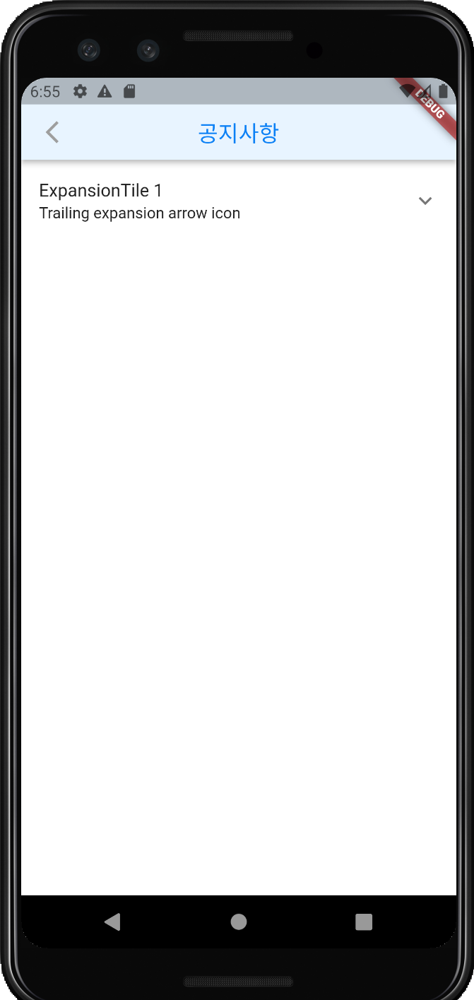

# ExpansionTile

접었다 폈다 할 수 있는 위젯

 

```dart
class _noticePageState extends State<noticePage> {
  bool _customTileExpanded = false;

  Widget _expansionTile() {
    return const ExpansionTile(
      title: Text('ExpansionTile 1'),
      subtitle: Text('Trailing expansion arrow icon'),
      children: <Widget>[
        ListTile(title: Text('This is tile number 1')),
      ],
    );
  }

  @override
  Widget build(BuildContext context) {
    return Scaffold(
      appBar: AppBarBack(title: '공지사항'),
      body: Column(
        children: <Widget>[
          _expansionTile(),
        ],
      ),
    );
  }
}
```