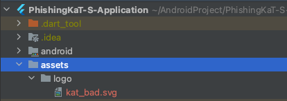

# Flutter Image 

- SVG 파일의 경우
    1. pubspec.yaml
      flutter_svg 패키지 추가   

    ```yaml
    dependencies:
        flutter_svg: ^1.0.1
    ```

    2. assets 폴더 생성   
   
    

    3. pubspec.yaml
       assets 경로 추가

    ```yaml 
    assets: 
        - assets/logo/
    ```

    4. 코드 
    ```dart
    SvgPicture.asset('assets/logo/kat_bad.svg', width:100, height: 100)
    ```

- PNG, JPG 파일의 경우
  
    1. assets 폴더 생성 & pubspec.yaml 경로 추가 
   
    2. 코드
    ```dart
    Image.asset('assets/logo/kat_bad.png')
    ```
