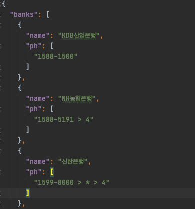

# Read Json file 

## 1. assets 디렉터리 안에 json 디렉터리 생성 & 파일 추가 

pubspec.yaml 파일에서 'assets/json/' 경로 추가 후, pub get 실행

## JSON file (assets/json/bank.json)


## Error
자주 접한 에러로 우리 코드가 ```List<String>``` 을 요구하고 있지만, ```LIst<dynamic>``` 을 응답받는 경우에 아래와 같은 에러가 뜨게 된다. 

```bash
type 'List<dynamic>' is not a subtype of type 'List<String>'
```

## 해결 방법

- 오류 코드 
```dart 
class Bank {
  final String name ;
  final List<String> phones ;

  Bank({required this.name, required this.phones}) ;

  factory Bank.fromJson(Map<String, dynamic> json) {
    return Bank(
      name : json['name'],
      phones : json['ph'], 
    );
  }
}
```

- 올바른 코드
```dart 
class Bank {
  final String name ;
  final List<String> phones ;

  Bank({required this.name, required this.phones}) ;

  factory Bank.fromJson(Map<String, dynamic> json) {
    return Bank(
      name : json['name'],
      phones : List<String>.from(json['ph']), 
    );
  }
}
```

## Full Code 

``` dart 
import 'dart:convert';
import 'package:flutter/services.dart' ;

class Bank {
  final String name ;
  final List<String> phones ;

  Bank({required this.name, required this.phones}) ;

  factory Bank.fromJson(Map<String, dynamic> json) {
    return Bank(
      name : json['name'],
      phones : List<String>.from(json['ph']), 
    );
  }
}

class _Page extends State<Page> {
    List<Bank> banks = [] ;
    // 비동기 방식으로 local json 파일을 읽어줍니다. 
    Future ReadJsonData() async {
        final String loadJson = await rootBundle.loadString('assets/json/bank.json');
        final res = json.decode(loadJson);

        // json에 banks 안에 bank에 대한 내용이 있기 때문에 iterator를 사용하여 하나씩 추가해줍니다. 
        for (var bank in res['banks']) {
            banks.add(Bank.fromJson(bank)) ;
        }
    }

    @override
    void initState() {
        super.initState();
        ... 
        ReadJsonData(); // 추가 
    }
}
```