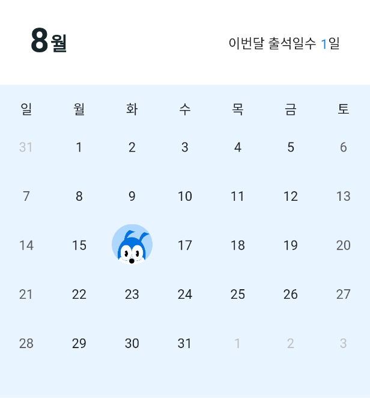

# Pub.dev

- table_calendar
  - pub.dev [https://pub.dev/packages/table_calendar]
  - github [https://github.com/aleksanderwozniak/table_calendar]

```dart
TableCalendar(
  firstDay: DateTime(_now.year, _now.month, 1),
  lastDay: DateTime(_now.year, _now.month + 1, 0),
  focusedDay: _now,
  calendarFormat: _calendarFormat,
  daysOfWeekHeight: 30,
  headerVisible: false,
  calendarBuilders: CalendarBuilders(
    dowBuilder: (context, day) {
      return Center(child: Text(days[day.weekday])) ;
    },

    todayBuilder: (context, date, _) {
      return Container(
      width: MediaQuery.of(context).size.width * 0.11,
      padding: const EdgeInsets.only(bottom: 5),
      child: Image.asset('assets/images/attendance.png',));
    },  
  ),
  selectedDayPredicate: (day) {
  // Use `selectedDayPredicate` to determine which day is currently selected.
  // If this returns true, then `day` will be marked as selected.

  // Using `isSameDay` is recommended to disregard
  // the time-part of compared DateTime objects.
  return isSameDay(_selectedDay, day);
  },
  onDaySelected: (selectedDay, focusedDay) {
    if (!isSameDay(_selectedDay, selectedDay)) {
      // Call `setState()` when updating the selected day
      setState(() {
        _selectedDay = selectedDay;
        _now = focusedDay;
      });
    }
  },
  onFormatChanged: (format) {
    if (_calendarFormat != format) {
      // Call `setState()` when updating calendar format
      setState(() {
      _calendarFormat = format;
      });
    }
  },
  onPageChanged: (focusedDay) {
  // No need to call `setState()` here
    _now = focusedDay;
  },
),
```

## 코드 결과

