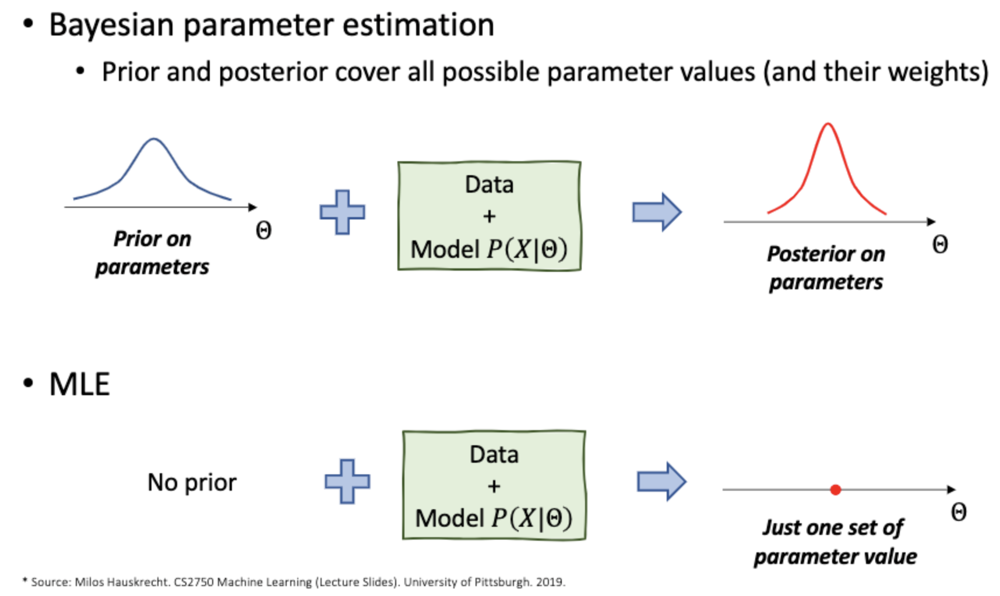

### **:star: Standard (IID) assumption :star:**

1. 샘플은 서로 독립이다. ( Samples are independent of each other. )
2. 샘플은 동일한 분포를 따른다. ( Samples are coming from the same distribution. )
3. 샘플은 동일한 분포에서 독립이다. ( Samples are independent identically distributed. )

# 1. 밀도 추정 (Density Estimation)

**얻어진 관측 데이터들의 분포로부터 원래 변수의 확률 분포 특성을 추정하고자 하는 것**

**즉, 어떤 변수 x의 밀도(density)를 추정하는 것은 x의 확률밀도함수를 추정하는 것과 같다.**

*통계학에선 밀도(density)를 확률 밀도(Probability density)로 해석*

x = a 일 확률은 0 이지만, a에서의 밀도(density)는 f(a)로 0이 아니다. 

**어떤 변수의 확률밀도함수를 구할 수 있다면, 그 변수가 가지는 값의 범위, 확률 분포, 특성 등을 모두 구할 수 있기 때문에 밀도 추정 (Density estimation)을 진행한다.**

- ## 1.1 Parametric Density Estimation

    **미리 확률밀도함수(PDF)에 대한 모델을 정해놓고 데이터들로부터 모델의 파라미터만 추정하는 방식** 
    
    특정 변수가 정규 분포를 따른다고 가정하면, 평균과 분산만 구하면 쉽게 해결할 수 있다. 

    하지만, 현실에서는 데이터만 보고 모델의 형태를 정하는 것은 억지스러운 가정에 가깝다. 그렇기에, Non-parametric 밀도 추정을 사용하여 순수 데이터로부터 확률밀도함수를 추정해야한다. 

    - ### 1.1.1 MLE (Maximum Likelihood Estimation)

        **Likelihood**
        IID assumption을 따를 때, D의 Likelihood

        $$
        \prod_{n=1}^{N} P(d_n | \theta)
        $$

        :bulb: **단순 Likelihood 연산을 하게 되면, 매우 작은 값에 도달하게 되어 numerical underflow가 발생할 수 있다. 그러므로, log-likelihood를 사용** 

        **Log-likelihood**

        $$
        \sum_{n=1}^{N} log\ P(d_n | \theta)
        $$

        이와 같이, log-likelihood 연산을 사용하여 Maximum 값을 구하는 것이 MLE 이다. 

        **MLE formula**

        $$
        argmax_{\theta}\ log\ P(d_n|\theta)
        $$

        **MLE 단점**
        MLE는 파라미터 값들 중 단 하나만 고르게 된다. **그리하여, likelihood 측면에서 가까운 두 개의 서로 다른 파라미터 값이 있는 경우, 둘 중 하나만 사용하면 강한 치우침이 발생할 수 있다는 문제점을 가진다.** 

        (If there are two different parameter values that are close in terms of the likelihood, using only one of them may introduce a strong bias)

    - ### 1.1.2 Bayesian Parameter Estimation 
      - 단 하나의 파라미터 값을 뽑는 MLE의 한계점을 극복 
      - Uses the posterior distribution for parameters Θ
      - Posterior covers all possible parameter values (and weights)
          - $P(\theta|D)=\frac{P(D|\theta)P(\theta)}{P(D)}$

      *($P(\theta|D)$: Parameter posterior, $P(\theta)$: Parameter prior, $P(D|\theta)$: Data likelihood)*

    ### Baysian vs MLE 
    

- ## 1.2 Non-prarmetric Density Estimation

**Non-prarmetric Density Estimation의 간단한 형태가 히스토그램(Historgram)이다. 즉, 관측된 데이터로부터 히스토그램을 구한 후, 정규화하여 확률밀도함수로 사용하는 것이다.** 

**히스토그램의 문제점**
1. bin의 경계에서 불연속성
2. bin의 크기 및 시작 위치에 따라서 히스토그램이 달라짐
3. 고차원 데이터에는 메모리 문제로 사용 어려움

**개선 방안**
커널 밀도 추정 (KDE)를 사용하여 히스토그램의 단점을 개선 가능

   - ### 1.2.1 커널 밀도 추정 (Kernel Density Estimation, KDE)

        히스토그램을 이용한 밀도 추정은 이산적(discrete)로 binary 값을 증가시켜 불연속성을 가진다. 반면에, 커널 밀도 추정은 커널 함수를 사용하여 Smooth한 확률밀도함수(PDF)를 만들 수 있게 된다. 

        대표적인 커널 함수: Gaussian, Epanechnikov, Uniform

        $$
        P_{KDE}(x) = \frac{\sum_{n=1}^{N}\ {K(\frac{x-x_i}{h})}}{Nh^d}
        $$
       
        ##### KDE 과정

        1. 각 데이터마다 해당 데이터를 중심으로 하는 커널 함수를 생성
        2. 만들어진 커널 함수들을 모두 더한 후, 전체 데이터 개수로 나눈다. 

        **Bandwidth**
        h 값이 작을수록 뾰족, h 값이 클수록 완만

        **최적의 Bandwidth**
        
        $$
        h = \sigma(\frac{4}{3N})^\frac{1}{5}
        $$

        *( N: 샘플 데이터 개수, $ \sigma $: 표준 편차 )*
